# Cloudscape 3D · 行业三维解决方案平台

**一句话定位**：以 Three.js 为核心、由大模型驱动内容生成、覆盖多行业的 3D 数字孪生与三维可视化解决方案平台。

**在线演示**：https://4173-88416bd996f1c0a8.code.cosmoplat.cn

## 核心亮点

- **智能体工作台**：用自然语言生成 3D 场景，四级生成流水线（内置直通 / 增量修改 / 大模型解析 / 本地兜底），直通实测约 0.3 秒
- **多行业解决方案**：工业拆解、天文科普、整车换色、古建展馆、WebAR、老家电博物馆等可交互演示
- **WebAR 三级降级链**：图像追踪 → 实景叠加 → 纯虚拟模拟，任意设备都能进入体验，不会卡在权限门口
- **手势交互**：MediaPipe Hands 手部追踪，握拳与手掌移动驱动模型操作，摄像头预览实时绘制 21 点手部骨骼
- **大模型内容中枢**：输入行业场景，输出完整决策链（场景分析 / 模型组合 / 展陈方案 / 实施步骤 / 成本估算）
- **压缩模型管线**：Draco + Meshopt + WebP 三重压缩，模型资源用户上传即可接入，零配置

## 页面预览

| 智能体工作台 | 行业 3D 案例库 |
| --- | --- |
| 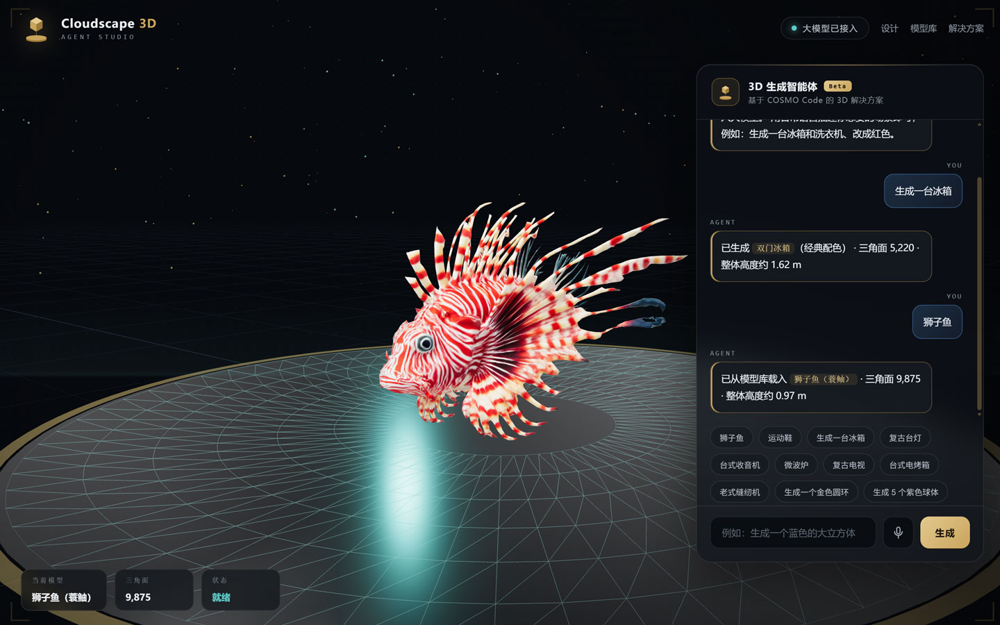 | 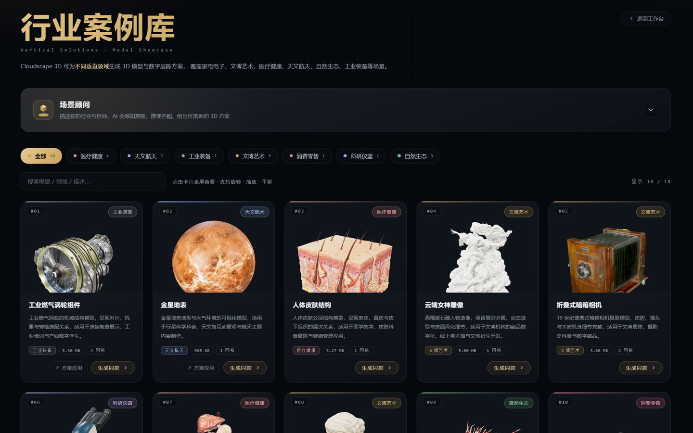 |

| 模型全屏查看器 | 解决方案总览 |
| --- | --- |
| 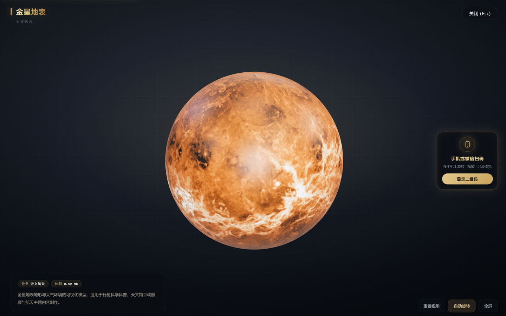 | 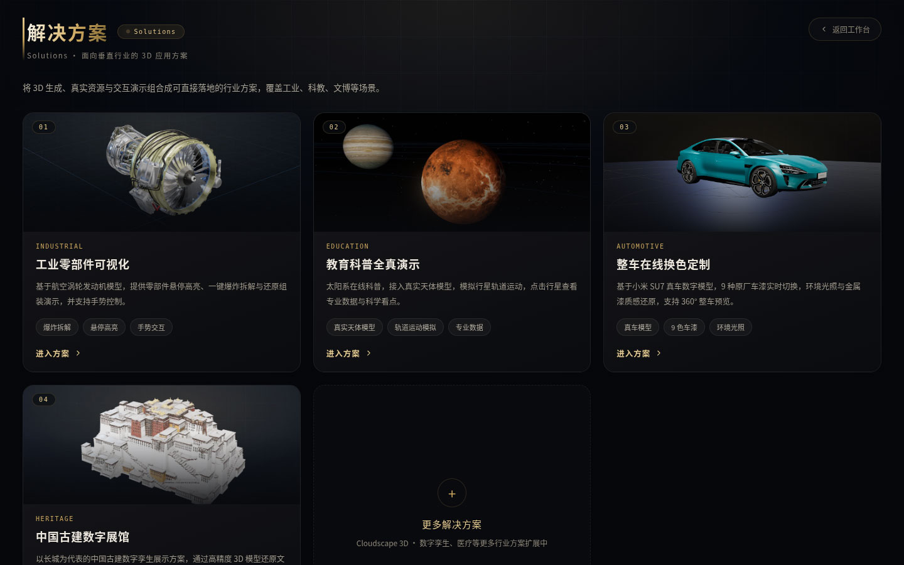 |

| 工业零部件可视化 | 教育科普全真演示 |
| --- | --- |
| 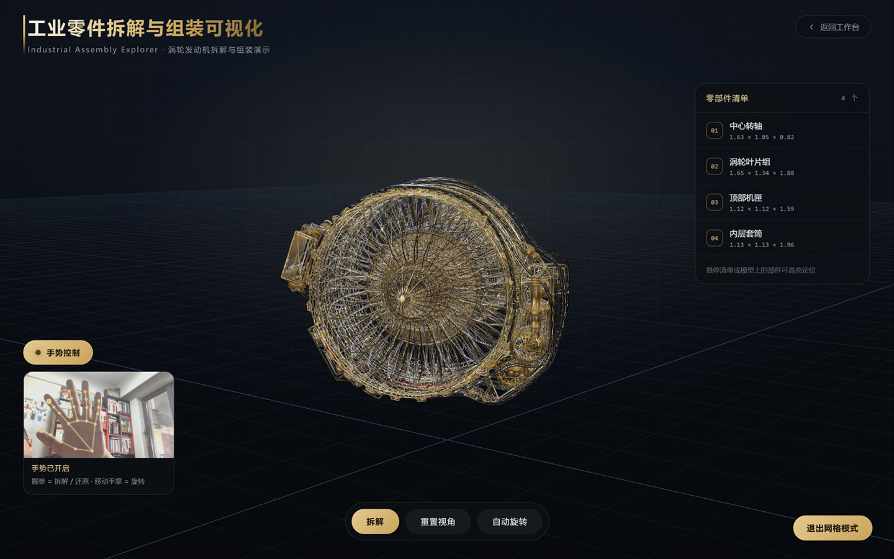 | 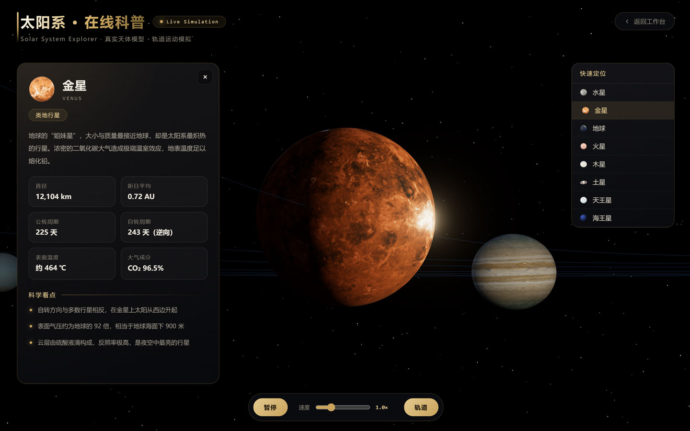 |

| 中国古建数字展馆 | 长城 AR 互动体验 |
| --- | --- |
| 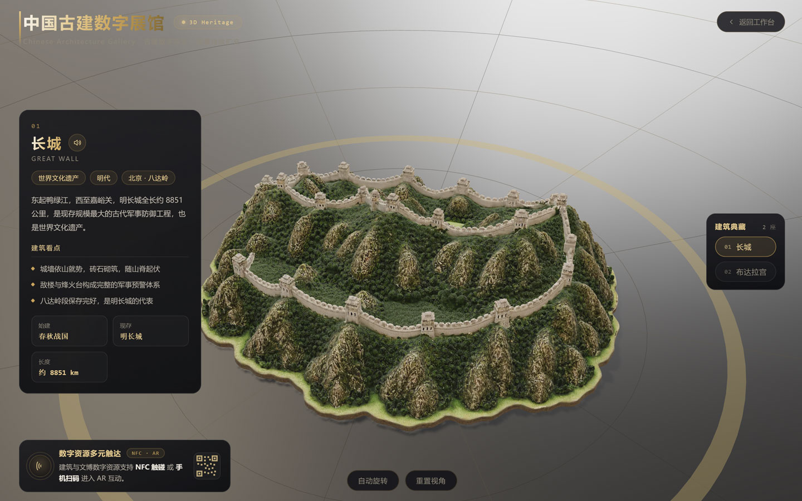 | 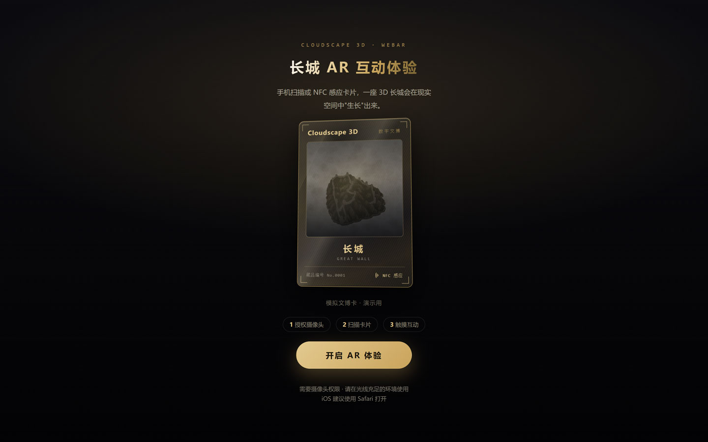 |

| 社区 Demo | |
| --- | --- |
| 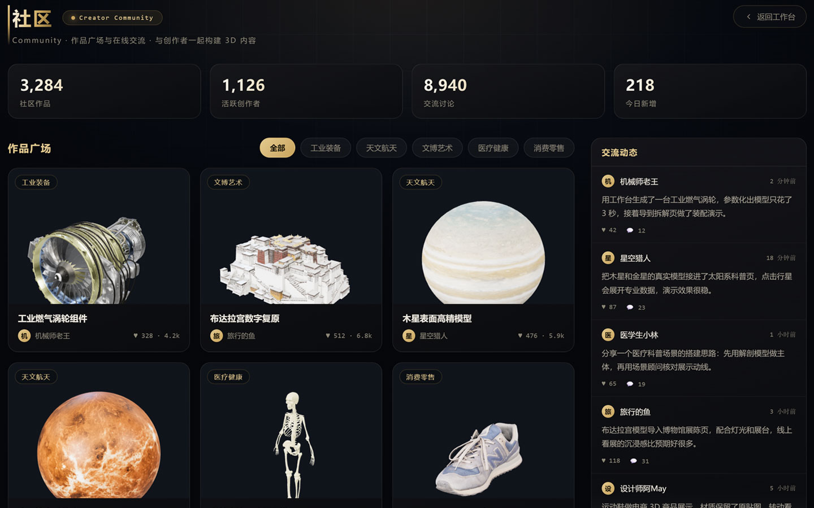 | |

---

## 项目简介

Cloudscape 3D 是一套完整的「前端多页面应用 + Node 服务端 + 大模型内容中枢」三层架构系统。它同时承担三种角色：面向终端用户的 **3D 演示产品**、面向行业的 **解决方案陈列窗口**、以及面向开发者的 **三维渲染与生成能力基座**。

平台内置智能体工作台、行业 3D 案例库、行业方案中枢，并以独立页面的形式交付工业拆解、天文科普、整车换色、古建展馆、WebAR、老家电博物馆等多个可交互演示场景。

---

## 目录

- [一、系统架构](#一系统架构)
- [二、技术栈](#二技术栈)
- [三、核心子系统](#三核心子系统)
  - [3.1 模型加载与渲染管线](#31-模型加载与渲染管线)
  - [3.2 智能体工作台生成引擎](#32-智能体工作台生成引擎)
  - [3.3 行业方案中枢（Advisor 决策链）](#33-行业方案中枢advisor-决策链)
  - [3.4 手势交互子系统](#34-手势交互子系统)
  - [3.5 实时音效合成子系统](#35-实时音效合成子系统)
  - [3.6 参数化换色子系统](#36-参数化换色子系统)
  - [3.7 拆解与装配子系统](#37-拆解与装配子系统)
- [四、页面矩阵](#四页面矩阵)
- [五、目录结构](#五目录结构)
- [六、后端 API](#六后端-api)
- [七、数据规范](#七数据规范)
- [八、工程化与构建](#八工程化与构建)
- [九、运行与部署](#九运行与部署)
- [十、环境变量](#十环境变量)
- [十一、资源策略](#十一资源策略)
- [十二、安全与许可](#十二安全与许可)
- [十三、术语表](#十三术语表)

---

## 一、系统架构

平台采用前后端分离的三层架构：浏览器端负责三维渲染与交互，Node 服务端负责大模型代理与资源清单管理，大模型服务负责语义理解与内容生成。

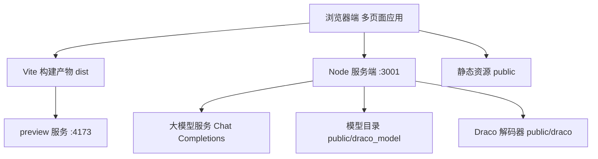

**关键设计原则**

1. **渲染与生成解耦**：三维渲染完全运行在浏览器端，服务端只承担语义解析与资源调度，避免大模型响应阻塞渲染线程。
2. **模型资源零配置接入**：新增模型只需将 glb 放入约定目录，服务端启动后自动扫描并纳入清单，无需改动前后端代码。
3. **凭据边界清晰**：大模型密钥仅存在于服务端进程环境变量，前端构建产物中不包含任何密钥。
4. **渐进增强的生成策略**：从「本地直通」到「大模型理解」按成本递增排序，绝大多数简单请求在本地毫秒级完成。

---

## 二、技术栈

| 层级 | 技术选型 | 版本 | 职责 |
| --- | --- | --- | --- |
| 三维引擎 | Three.js | `^0.186.1` | 场景、材质、光照、动画、后处理 |
| 模型加载 | GLTFLoader | 内置 | glTF / GLB 解析 |
| 解压扩展 | DRACOLoader | 内置 | `KHR_draco_mesh_compression` |
| 解压扩展 | MeshoptDecoder | 内置 | `EXT_meshopt_compression` |
| 贴图扩展 | WebP 扩展 | 内置 | `EXT_texture_webp` |
| 动画扩展 | KHR 扩展组 | 内置 | `KHR_texture_transform`、`KHR_mesh_quantization` |
| 相机控制 | OrbitControls | 内置 | 旋转 / 缩放 / 阻尼 |
| 环境光照 | RoomEnvironment | 内置 | PMREM 程序化环境贴图 |
| 构建工具 | Vite | `^8.3.1` | 多页面打包、开发服务器、代理 |
| 服务端 | Node.js 原生 HTTP | ESM | 大模型代理、资源清单、静态服务 |
| 手势识别 | MediaPipe Hands | `0.4.x` | 21 关键点手部追踪 |
| 音效合成 | Web Audio API | 原生 | 机械轴体参数化音效 |
| 页面自动化 | Puppeteer | `^25.12.0` | 截图、封面生成、无头验证 |
| 样式体系 | 原生 CSS | — | 统一黑金设计语言 |

---

## 三、核心子系统

### 3.1 模型加载与渲染管线

渲染管线需同时兼容 Draco 压缩、Meshopt 压缩、量化网格与 WebP 贴图四种扩展，任一环节缺失都会导致模型加载失败或几何错位。

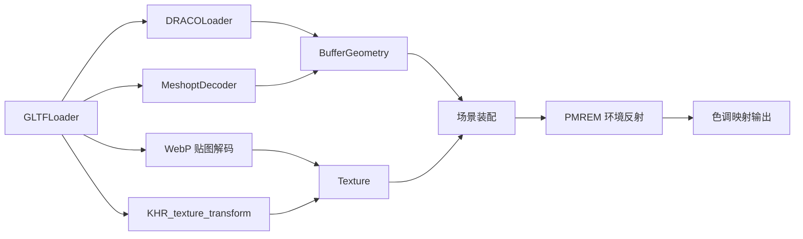

**管线要点**

- **解码器路径**：`DRACOLoader.decoderPath` 固定为 `/draco/`，解码器资源位于 `public/draco/`。
- **Meshopt 解码器**：`loader.setMeshoptDecoder(MeshoptDecoder)`，用于 `EXT_meshopt_compression` 压缩的 bufferView。
- **色彩管理**：渲染器输出色彩空间设为 `SRGBColorSpace`，材质基色因子按 sRGB 转换写入，避免换色偏色。
- **色调映射**：采用 `ACESFilmicToneMapping`，保证高光滚降与金属反射的自然表现。
- **环境光照**：使用 `PMREMGenerator` 从 `RoomEnvironment` 或 HDR 全景图生成预滤波环境贴图，为金属与清漆材质提供反射信息。
- **阴影系统**：`PCFSoftShadowMap` 软阴影，定向光投射，地面网格接收，模型自身关闭接收避免自阴影脏斑。

**统一归一化策略**：不同来源的模型尺寸差异巨大（从厘米级到公里级），加载后统一执行「包围盒居中 + 最大边缩放 + 底部贴地」三步归一化，再按高度动态推导相机距离与轨道参数。

### 3.2 智能体工作台生成引擎

工作台（`index.html`）是平台的核心交互入口，接收自然语言描述并生成三维场景。生成过程按成本递增分为四级流水线。

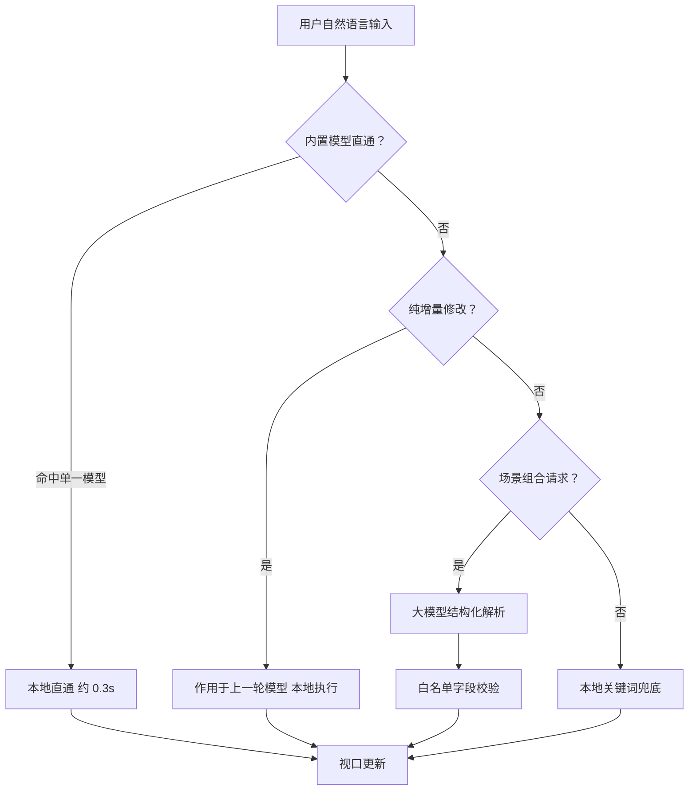

**四级生成策略**

1. **内置模型直通**：文本长度较短、不含场景连接词、且恰好命中单一模型时，由 `matchLocalModel` 本地直接生成。
2. **增量修改**：换色、改尺寸、改数量等纯修饰指令直接作用于上一轮模型，避免整场景重建。
3. **大模型场景解析**：复杂场景、风格描述、多物体组合交由大模型理解，服务端返回结构化建模指令。
4. **本地兜底**：大模型不可用时回退到本地模型解析，保证离线可用性。

**服务端结构化输出校验**：大模型返回的 JSON 经过字段白名单校验（`sanitize`），对象数量上限 6，非法字段一律丢弃，防止模型输出污染渲染层。

**语音输入**：基于 Web Speech API 的语音识别接入工作台，语音转写结果与文本输入走同一生成流水线。

### 3.3 行业方案中枢（Advisor 决策链）

模型库页面（`gallery.html`）内置「行业方案中枢」，将用户的行业场景描述转换为一条可执行的设计决策链。

**决策链五阶段**

| 阶段 | 字段 | 产出 |
| --- | --- | --- |
| 场景分析 | `analysis` | 行业领域、核心目标、受众与约束 |
| 模型组合 | `combination` / `recommended` | 模型搭配逻辑与推荐清单 |
| 展陈方案 | `display` | 布局、交互方式与呈现形式 |
| 实施步骤 | `steps` | 3~5 个可执行阶段 |
| 成本估算 | `cost` | 资源 / 开发 / 运维量级与总额 |

**工程实现要点**

- **Prompt 工程**：系统提示词固化为角色定义 + 五阶段输出规范 + JSON Schema 约束 + 质量要求，全部输出为纯 JSON，不含 Markdown 代码块。
- **推荐校验**：模型推荐结果与实时模型清单做名称/标题双重匹配，过滤幻觉标题，最多保留 6 个。
- **成本口径控制**：成本项采用「轻量落地口径」，金额取行业常见区间下限；服务端对金额文本执行数值缩放归一化，避免虚高报价。
- **上下文注入**：每次请求将当前模型库清单（标题 / 分类 / 描述）作为系统上下文注入，保证推荐结果始终基于真实存在的模型。

### 3.4 手势交互子系统

在工业拆解页与整车换色页中接入手势控制，将摄像头画面转换为三维操作指令。

**处理链路**

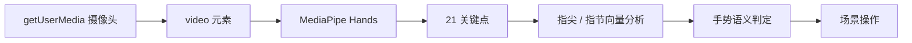

**实现细节**

- **关键点判定**：通过指尖 `[8,12,16,20]` 与近端指节 `[6,10,14,18]` 的纵向位置关系统计伸展手指数，`≤1` 判定为握拳。
- **姿态映射**：以掌心关键点 `[9]` 的横向归一化坐标线性映射到模型偏航角，实现「手掌左右移动即旋转模型」。
- **手势语义**：握拳触发状态切换（拆解页为爆炸/还原，换色页为车漆轮换）。
- **帧驱动**：通过 `requestAnimationFrame` 主动拉取识别帧，配合 `readyState` 校验避免空帧异常。
- **按需授权**：面板默认展开并处于激活态，但仅在用户点击授权按钮后才申请摄像头权限，符合浏览器权限规范。
- **可拖动面板**：控制面板支持指针拖拽自由摆放，拖拽与点击通过位移阈值区分。

### 3.5 实时音效合成子系统

打字训练页面[已下线]使用 Web Audio API 实时合成机械键盘音效，不使用任何音频文件。

**合成结构**

- **预生成噪声缓冲**：120ms 褐噪声缓冲，通过一阶低通累积生成，作为所有撞击声的基础层。
- **多段包络叠加**：
  - 轴心 click：带通滤波噪声，8ms 极短包络
  - 键帽 clack：带通滤波噪声，16ms 短包络
  - 腔体 thock：正弦扫频振荡器，低频、70~120ms 衰减
  - 回弹 top-out：低通滤波噪声，10ms 微弱包络
- **键位差异化**：空格键与宽键（≥2u）使用更低基频、更长衰减与额外卫星轴余震。
- **轴体参数化**：青轴 / 茶轴 / 红轴通过三套滤波频率与增益参数切换，无需更换音频资源。
- **动态处理**：总线串联压缩器（阈值 -20dB、比率 6:1），保证高频击键不削波。

### 3.6 参数化换色子系统

整车换色页面（`su7.html`）实现无损车身换色，核心技术是不触碰贴图、仅替换材质的基色因子。

**实现原理**

- 车身漆面材质为纯色 `baseColorFactor`，无 baseColor 贴图，仅有独立的 AO 贴图通道。
- 换色即替换材质的颜色值，AO 明暗细节、清漆高光与环境反射全部保留。
- 色彩按 sRGB 空间写入，避免线性/伽马转换偏差。
- 通过调整金属度、粗糙度与环境反射强度强化金属漆质感，并降低 AO 强度消除漆面脏斑。
- 车身网格关闭阴影接收、保留阴影投射，得到干净的漆面与正确的落地投影。

### 3.7 拆解与装配子系统

工业拆解页面（`disassembly.html`）实现零部件爆炸拆解与还原组装。

- **部件划分**：按语义将模型划分为若干部件，建立网格到部件的映射表。
- **轴向散开**：沿主轴方向对部件施加位移偏移，形成爆炸视图。
- **补间动画**：使用缓动函数驱动的数值补间，拆解与还原双向平滑过渡。
- **悬停高亮**：射线拾取与部件映射回溯，实现零部件悬停识别与标签跟随。
- **手势联动**：握拳手势切换拆解状态，与鼠标交互并存。

---

## 四、页面矩阵

| 路径 | 页面 | 核心能力 | 关键技术 |
| --- | --- | --- | --- |
| `/` | 智能体工作台 | 自然语言生成三维场景 | 四级生成流水线、语音输入、视口管理 |
| `/gallery.html` | 行业 3D 案例库 | 模型陈列、检索、全屏查看 | 静态封面、空闲预加载、Advisor 决策链 |
| `/solutions.html` | 解决方案总览 | 行业方案入口聚合 | 响应式卡片网格 |
| `/disassembly.html` | 工业零部件可视化 | 爆炸拆解、悬停高亮 | 部件映射、轴向散开、射线拾取、手势 |
| `/solar.html` | 太阳系在线科普 | 行星轨道运动、数据解读 | 真实天体模型、轨道模拟、信息面板 |
| `/su7.html` | 整车在线换色定制 | 9 色车漆实时切换 | 材质因子替换、HDR 环境、手势 |
| `/architecture.html` | 中国古建数字展馆 | 古建模型展示与档案 | 模型切换、动态相机适配、档案面板 |
| `/ar.html` | 长城 AR 互动体验 | 扫描卡片 / 实景叠加 / 纯模拟三级降级 | WebAR 图像追踪、实景合成、陀螺仪环视 |
| `/museum.html` | 老家电博物馆 | 藏品环绕展示、故事解读 | 悬浮信息卡、展台漫游 |
| `/community.html` | 社区 Demo | 作品流与创作者展示 | 静态数据渲染、访问门禁提示 |

> 页面顶栏遵循统一设计规范：左侧标题区（金色渐变标题 + 副标题 + 左侧金色竖线），右上角返回工作台按钮（胶囊描边、悬停右移）。所有页面统一声明 favicon。

---

## 五、目录结构

```text
.
├── README.md
├── package.json
├── vite.config.js              # 多页面入口、代理、allowedHosts
│
├── index.html                  # 智能体工作台
├── gallery.html                # 行业 3D 案例库
├── solutions.html              # 解决方案总览
├── disassembly.html            # 工业零部件可视化
├── solar.html                  # 太阳系在线科普
├── su7.html                    # 整车在线换色定制
├── architecture.html           # 中国古建数字展馆
├── museum.html                 # 博物馆数字化展陈
├── community.html              # 社区 Demo
├── logo-candidates.html        # 标识设计候选页
├── cover-gen.html              # 封面生成工具页
│
├── src/
│   ├── agent/                  # 工作台子系统
│   │   ├── main.js             # 主逻辑与生成分支
│   │   ├── generator.js        # 模型清单、本地生成、关键词匹配
│   │   ├── library.js          # 模型库匹配与 glb 加载
│   │   ├── llm.js              # 大模型通信封装
│   │   ├── viewport.js         # 三维视口
│   │   └── agent.css
│   ├── models/                 # 参数化模型定义
│   ├── data/
│   │   └── products.js         # 博物馆藏品数据
│   ├── gallery.js              # 案例库逻辑
│   ├── solutions.js            # 解决方案数据与渲染
│   ├── solutions.css
│   ├── disassembly.js          # 拆解逻辑与手势
│   ├── disassembly.css
│   ├── solar.js                # 太阳系逻辑
│   ├── solar.css
│   ├── su7.js                  # 换色逻辑与手势
│   ├── su7.css
│   ├── architecture.js         # 古建展馆逻辑
│   ├── architecture.css
│   ├── community.js
│   ├── community.css
│   ├── main.js                 # 博物馆逻辑
│   ├── style.css
│   └── cover-gen.js
│
├── server/
│   └── index.js                # Node 服务端（LLM 代理 + 资源清单 + 静态服务）
│
├── scripts/
│   ├── export-glb.js           # 参数化模型导出为 glb
│   ├── screenshot.js           # 页面截图
│   └── model-preview.html      # 模型预览工具页
│
├── public/
│   ├── draco/                  # Draco 解码器（js + wasm）
│   ├── draco_model/            # 模型库 glb 与 catalog.json
│   ├── models/                 # 内置参数化模型 glb
│   ├── solar/                  # 天体模型
│   ├── architecture/           # 建筑模型
│   ├── su7/                    # 整车模型、贴图、环境光
│   ├── covers/                 # 页面封面图
│   └── favicon.png
│
└── .cosmocode/
    └── MEMORY.md               # 项目协作记忆
```

---

## 六、后端 API

服务端基于 Node.js 原生 HTTP 模块构建，默认监听 `3001` 端口。

### GET `/api/models`

返回模型库清单。响应结构：

```json
{
  "files": [
    {
      "name": "turbine-v8",
      "file": "turbine-v8.glb",
      "url": "/api/models/raw/turbine-v8.glb",
      "size": 5555520,
      "title": "工业燃气涡轮组件",
      "description": "……",
      "category": "工业装备",
      "author": "",
      "license": "Sketchfab 授权",
      "source": "",
      "meshes": 12,
      "keywords": [],
      "order": 1
    }
  ]
}
```

- 模型来源：扫描 `public/draco_model/` 下所有模型文件
- 元数据来源：`catalog.json` 覆盖 > GLB 内嵌 `asset.extras` > 文件名推导
- 排序规则：`order` 升序，未指定 `order` 排末尾

### GET `/api/models/raw/<filename>`

返回原始模型文件流，用于前端按需加载与全屏查看。

### POST `/api/advisor`

行业方案中枢接口，返回五阶段决策链。

请求：

```json
{ "query": "我想做一个面向博物馆的数字化展陈方案" }
```

响应：

```json
{
  "analysis": "……",
  "combination": "……",
  "recommended": ["模型标题1", "模型标题2"],
  "display": "……",
  "steps": ["步骤1", "步骤2", "步骤3"],
  "cost": {
    "items": [{ "label": "模型资源", "value": "……" }],
    "total": "……"
  },
  "source": "llm"
}
```

### POST `/api/agent`

工作台自然语言生成接口，返回结构化建模指令，字段经白名单校验，对象数量上限 6。

---

## 七、数据规范

模型库元数据维护在 `public/draco_model/catalog.json`，以「文件名（不含扩展名）」为键：

| 字段 | 类型 | 说明 |
| --- | --- | --- |
| `title` | string | 中文标题，覆盖 GLB 内嵌标题 |
| `category` | string | 行业分类，覆盖关键词推断结果 |
| `order` | number | 排序权重，升序排列 |
| `description` | string | 中文描述，用于卡片与推荐上下文 |
| `keywords` | string[] | 检索与匹配别名 |
| `hidden` | boolean | 为 `true` 时不进入清单（下架而不删除文件） |

**行业分类体系**：家电电子 / 文博艺术 / 消费零售 / 工业装备 / 天文航天 / 自然生态 / 医疗健康 / 科研仪器。

---

## 八、工程化与构建

**多页面入口**：`vite.config.js` 的 `build.rollupOptions.input` 显式声明所有 HTML 入口，Vite 按入口分包构建。新增页面必须同步注册入口，否则不会产出构建产物。

**开发服务器与预览**：

- 开发服务器：`host: '0.0.0.0'`、默认端口 `5173`
- 预览服务器：`host: '0.0.0.0'`、默认端口 `4173`
- 两者均配置 `allowedHosts` 与 `/api` 反向代理至 `127.0.0.1:3001`

**资源路径约定**：所有模型、贴图、解码器均通过绝对路径引用（如 `/draco/`、`/models/`、`/api/models/raw/`），保证多页面下路径一致。

---

## 九、运行与部署

**安装依赖**

```bash
npm install
```

**启动后端**

```bash
npm run server
```

**构建前端**

```bash
npm run build
```

**启动预览**

```bash
npm run preview
```

**开发模式**

```bash
npm run dev
```

**模型导出**

```bash
npm run export:glb
```

**启动顺序**：先启动后端（3001），再启动前端预览或开发服务器。前端页面依赖后端接口提供模型清单与方案中枢能力。

---

## 十、环境变量

服务端通过环境变量接入大模型服务，未配置时自动降级为本地解析能力。可复制 `/.env.example` 作为配置模板。

| 变量 | 说明 | 默认 |
| --- | --- | --- |
| `AGENT_PORT` | 服务端监听端口 | `3001` |
| `MCAI_LLM_BASE_URL` | 大模型服务地址（OpenAI 兼容） | 空 |
| `MCAI_LLM_API_KEY` | 大模型服务密钥 | 空 |
| `MCAI_LLM_MODEL` | 大模型标识 | 空 |

> 密钥仅在设计时于服务端进程内读取，不写入任何前端产物，不输出到日志。

---

## 十一、资源策略

- **版本控制边界**：`public/**/*.glb` 大体积模型资源不纳入版本控制。
- **模型接入零配置**：新增模型只需放入 `public/draco_model/`，重启服务端即自动纳入清单。
- **封面缓存**：案例库封面以静态图片形式交付，避免运行时离屏渲染开销。
- **空闲预加载**：案例库在浏览器空闲时预加载模型资源，缩短查看器打开等待。
- **压缩格式优先**：模型侧优先使用 Draco 几何压缩与 WebP 贴图，显著降低传输体积。

---

## 十二、安全与许可

- **凭据隔离**：大模型密钥仅存在于服务端环境变量，前端不包含、不请求、不打印任何密钥。
- **输出校验**：所有进入渲染层的结构化数据均经过类型与字段白名单校验。
- **权限按需**：摄像头等敏感权限仅在用户显式操作后申请。
- **模型许可**：项目内模型统一标注为「Sketchfab 授权」。

---

## 十三、术语表

| 术语 | 说明 |
| --- | --- |
| 直通 | 命中内置模型后不调用大模型，本地直接生成 |
| 增量修改 | 仅修改上一轮模型的属性（颜色、尺寸、数量） |
| 决策链 | 行业方案中枢输出的五阶段结构化方案 |
| TKL | Tenkeyless，87 键紧凑布局 |
| PMREM | 预滤波环境贴图生成，用于 PBR 反射 |
| AO | 环境光遮蔽贴图，用于暗部细节 |
| 归一化 | 统一模型尺寸、位置与落地高度 |

---

## 关于

本项目由作者独立完成架构设计与工程实现，开发过程中使用 **COSMO Code** 智能开发平台开发。
